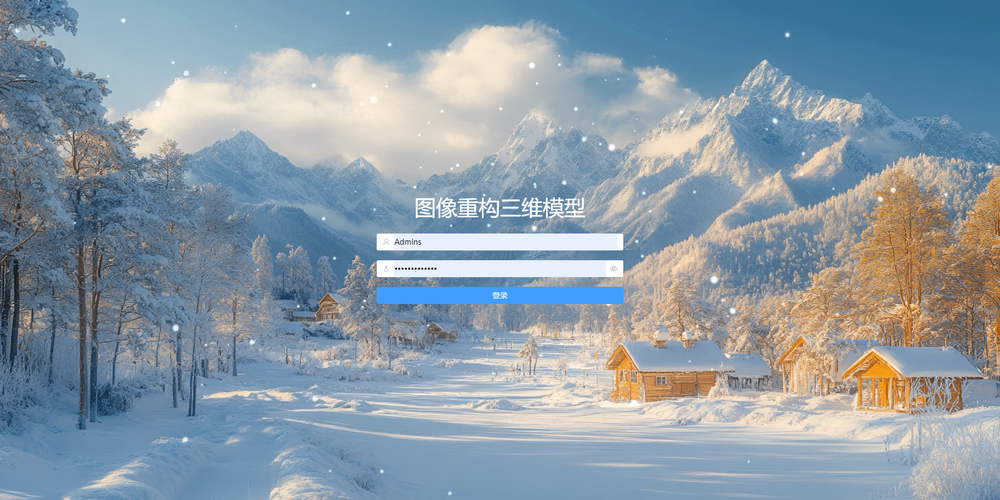
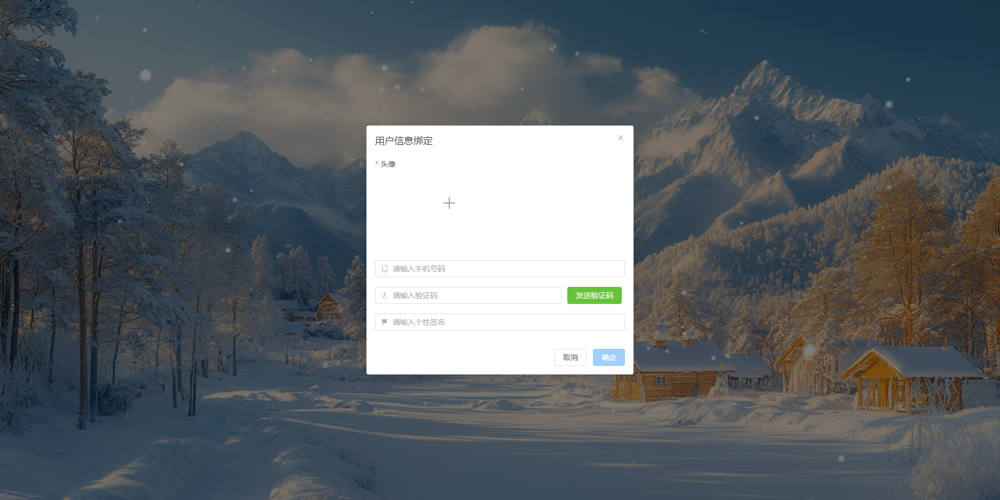
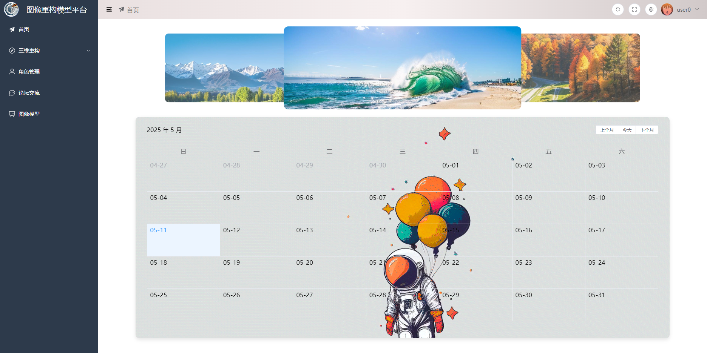
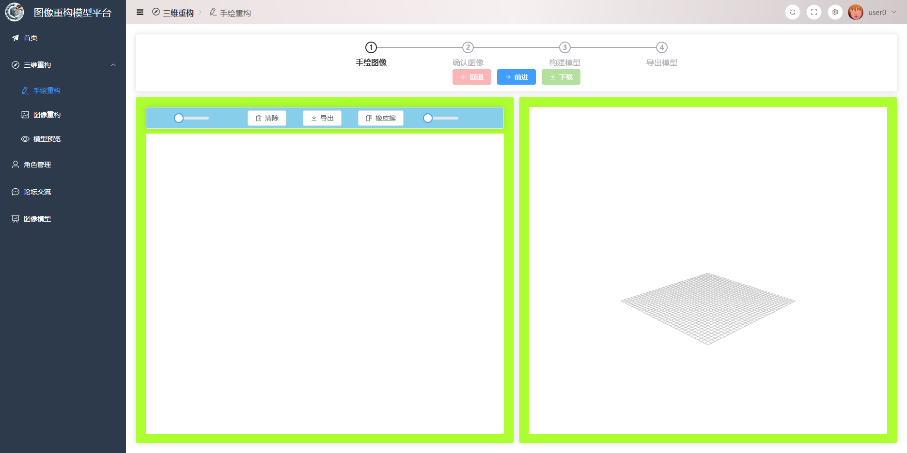
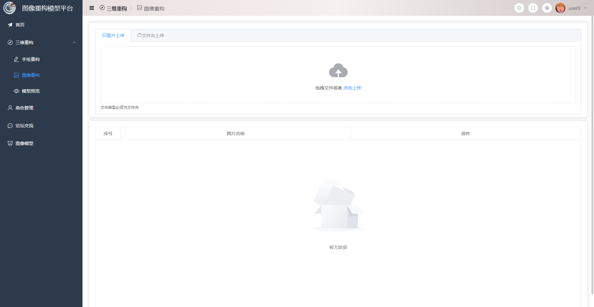
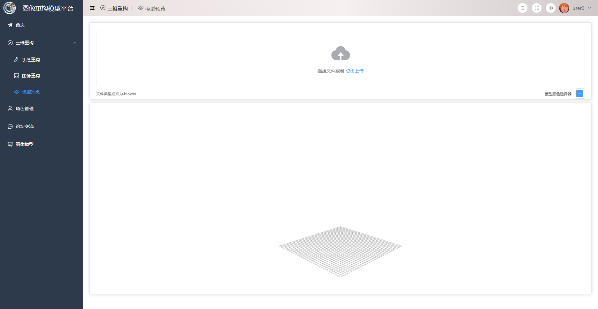
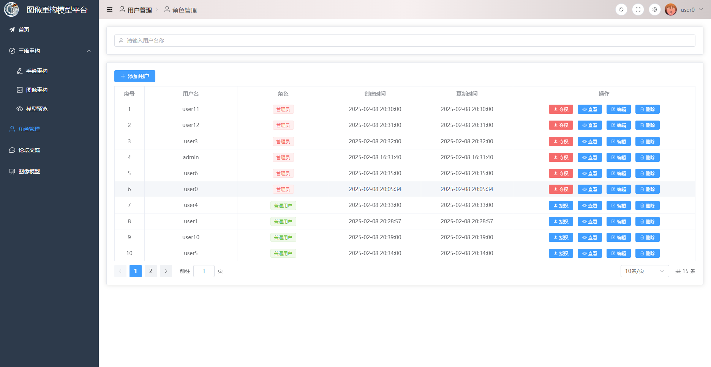
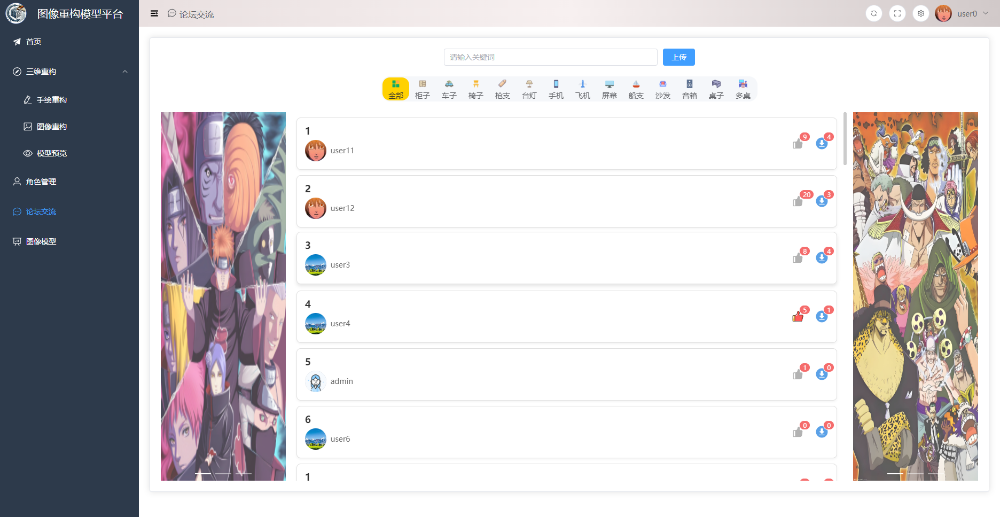
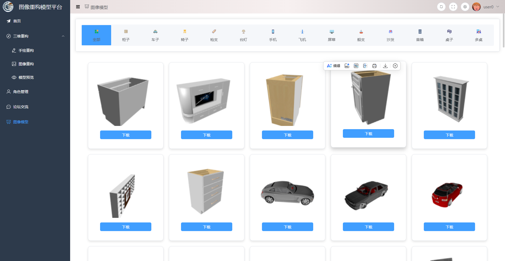

# 基于深度学习的三维重建系统——前端

## 项目介绍

该项目旨在构建一个基于深度学习的图像三维重建平台，实现从二维图像到三维模型的自动重建。用户可通过鼠标手绘图像或上传图片两种方式输入数据，系统后台通过部署的深度学习模型完成三维重建，并支持三维模型在线可视化、用户账户管理与社区互动交流等功能，打造一个集易用性与功能性于一体的综合性平台。

本系统按照前后端分离思想来开发，该项目为系统的前端项目。

## 项目技术栈（前端）

1）模块化与组件化设计：采用 Vue3 的组件体系，并结合 Composition API 对多次使用的核心代码和子组件进行封装，提高代码复用性和可维护性。

2）高效开发与构建：依赖 Vite 工具的即时热更新和高效的 ES 模块，优化前端性能。

3）状态管理：使用 Pinia 技术，对变量和方法进行全局状态管理。

4）路由管理：采用 Vue Router 技术，实现单页面应用的了路由配置和动态加载。

5）界面设计：项目集成 Element Plus 组件库，提升界面 UI 交互体验。

6）请求管理：利用封装 axios 的 request 进行 HTTP 请求，采用 RESTful 规范进行前后端联调交互。

7）多种工具：eslint、prettier 和 stylelint 插件检查代码格式和语法，husky 和 commitlint工具实现代码规范化提交到 Git 远程仓库。

## 项目效果图

用户登录界面



用户注册界面



首页界面



手绘重建界面



摄影重建界面



模型预览界面



用户管理界面

论坛分享界面



图像模型库界面



## 快速部署

1. 将前端项目拷贝到本地

2. 使用npm或者pnpm命令安装所需的依赖，启动项目

   ```
   # 安装依赖
   pnpm install
   
   # 在 localhost:3000 启动项目
   npm run dev
   ```

## 后端项目地址

https://github.com/21zh/Image-Reconstruction-System-Back-End.git
